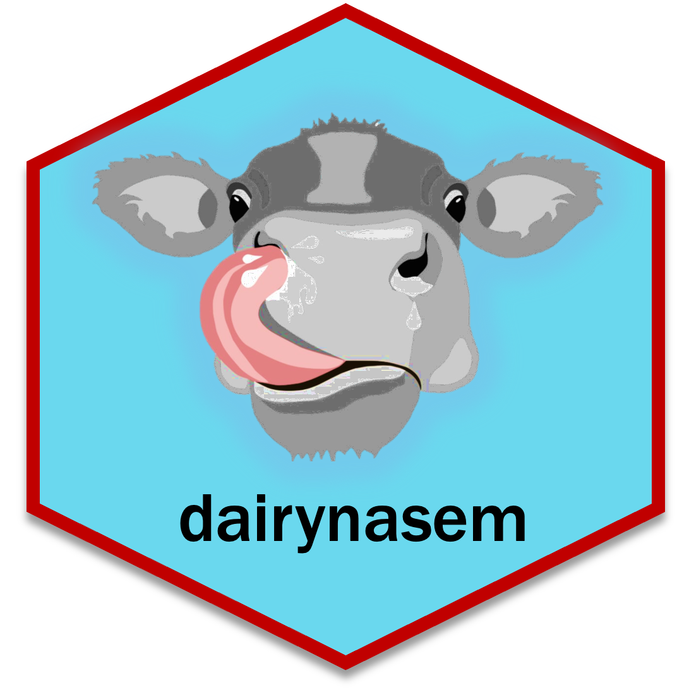

# Using the `dairynasem` package
- [Background](#background)
  * [Advantages of `dairynasem` package](#advantages-of-dairynasem-package)
  * [Potential features](#potential-features)
  * [Citing NASEM (2021) and this package](#citing-nasem-2021-and-this-package)
- [Update R to >= 4.3](#update-r-to--43)
  * [Windows](#windows)
  * [Mac](#mac)
- [Install and load the `dairynasem` package](#install-and-load-the--dairynasem--package)
- [Running NASEM (2021) simulations](#Running-NASEM-2021-simulations)
  * [Required inputs](#required-inputs)
    + [Diet Editor Google Sheet](#diet-editor-google-sheet)
  * [Optional inputs](#optional-inputs)
  * [Using `dn_run`](#using-dn-run)
- [Working with results](#working-with-results)
  * [Export](#export)
  * [Extract](#extract)
  * [Report](#report)
- [Custom feeds and libraries](#custom-feeds-and-libraries)
  * [Upload a library from spreadsheet](#upload-a-library-from-spreadsheet)
  * [Use `create_custom_feed` and `create_custom_library`](#use-create-custom-feed-and-create-custom-library)
- [Other possibilities](#other-possibilities)
- [Help](#help)




**Please note that this package was neither developed nor reviewed by anyone affiliated with the NASEM (2021) committee and is a beta version. Check all output against the NASEM (2021) program.**

# Background

In 2021, a committee of experts associated with the National Academies of Sciences, Engineering, and Medicine (NASEM) published a consensus report entitled "Nutrient Requirements of Dairy Cattle." The consensus report is available to purchase online (https://nap.nationalacademies.org/catalog/25806/nutrient-requirements-of-dairy-cattle-eighth-revised-edition). Additionally, the committee provided free software to run the nutritional model associated with the consensus report on Windows. The publisher recommends the consensus report and software be used by nutritionists and other professionals to evaluate dairy cattle diets. 

Along with the consensus report and software release, the NASEM (2021) committee published R source code. This code calculates model parameters for a single simulation and returns output in tables. Because the source code was intended for translation into the graphical NASEM software, it is functional but not user-friendly when run in R.

## Advantages of `dairynasem` package

This vignette discusses the `dairynasem` package, an R package designed to facilitate using the NASEM (2021) model in R. The `dairynasem` package builds on the source code developed by NASEM (2021) through several "wrapper functions" (i.e., these functions "wrap around" the original code without modifying it). When compared to the NASEM (2021) software and source code, the `dairynasem` package provides several advantages. These are compared below:

**NASEM graphical software**

- Can run one set of inputs (diet and one scenario) at a time
- Some default inputs, e.g., target amino acid efficiencies are provided
- User must type and select inputs in graphical interface, which is time-consuming and error-prone if many simulations must be run
- Output is written to tables in Word, which is good for archival but makes it difficult to do further analysis in R
- Program is only compatible with Windows OS

**NASEM R Source code**

- Can run one set of inputs (diet and one scenario) at a time
- No default inputs are provided, each argument requires a value
- Users enter and edit inputs in R, so it requires many lines of code per simulation
- Output is a nested list returned to R that can be used in further analysis, the code can also generate XML for tabular output in Word with additional effort
- Cross-platform compatible:  can be run on Mac or Windows OS

**`dairynasem` package**

- Many sets of inputs can be batched into the same run, i.e., multiple diets and multiple scenarios can be run with minimal code
- Default inputs are provided for infusions and target amino acid efficiencies
- Batches of inputs can be edited in a spreadsheet editor (e.g., Excel, Google Sheets) and uploaded to R
- Output is returned as a nested list to R
- `dairynasem` functions enable users to further manipulate output in R across simulations, or to quickly write a .txt file for each simulation for archival purposes
- Cross-platform compatible:  can be run on Mac or Windows OS

## Potential features

In addition to these advantages, **eventually**, the `dairynasem` package may include other features beyond NASEM (2021):

1. Additional descriptive warnings - the package may be updated to provide warnings for selected user errors related to feed and diet parameters (e.g., unusual feed or diet composition). This functionality will assist in catching any problematic inputs. 

1. Extensions - the package may be updated to provide extensions to the code published by NASEM (2021), e.g., to estimate other quantities related to NASEM outputs


## Citing NASEM (2021) and this package

If using this package, please remember to cite the NASEM (2021) consensus report and the `dairynasem` package. 

NASEM (2021) consensus report:

National Academies of Sciences, Engineering, and Medicine (NASEM). 2021. Nutrient Requirements of Dairy Cattle: Eighth Revised Edition. Washington, DC: The National Academies Press.

The dairynasem package:

Erickson, M.G. (2023). 'dairynasem Package: Wrapper functions for NASEM (2021) Nutrient Requirements of Dairy Cattle.' https://github.com/merickson3/dairynasem

# Update R to >= 4.3

It is always possible to manually download the latest versions through CRAN. To simplify the process of transferring packages, two other options are provided below.

## Windows

One way to do this is through installr. The package recommends executing this code in RGui, not RStudio. https://github.com/talgalili/installr/

```{r, eval = F}
install.packages('installr')
library(installr)
updateR() 
```

## Mac

Similarly, on Mac, use updateR. https://github.com/AndreaCirilloAC/updateR
```{r, eval = F}
install.packages("devtools")  # if not installed
library(devtools)
install_github('andreacirilloac/updateR')
library(updateR)
updateR()
```

# Install and load the `dairynasem` package

```{r, message = FALSE, warning = FALSE, eval = F}

install.packages("devtools") # if not installed
library(devtools)
install_github("merickson3/dairynasem")
library(dairynasem)


```

# Running NASEM (2021) simulations

## Required inputs

Inputs required for dairynasem are the same as those required for the NASEM (2021) graphical software. However, dairynasem allows the user to input batches of diets and scenarios. For example, several diets can be stacked into the same dataframe as an input. Several scenarios can also be stacked into one input dataframe. 

The ```run_dn()``` function requires two inputs:  1) diet_comp, a dataframe with diet IDs, diet ingredients, and the proportion of DM supplied by each ingredient, and 2) scenario, a dataframe with scenario identifiers and the remaining required inputs describing the animal and situation. Examples are provided within the package. These can be loaded into the Global Environment as shown below:

```{r}
data("diet_comp_ex_1")
diet_comp_ex_1
data("scenario_ex_1")
head(scenario_ex_1)
```

Users must provide diet_comp and scenario information using a similar structure to the examples shown above. At minimum, one diet and one scenario must be provided. It is straightforward to export the examples above as a csv, save renamed copies, modify them in a spreadsheet editor, and upload them to the Global Environment. 

### Diet Editor Google Sheet
Because selecting feed names that match the NASEM (2021) library can be challenging, the Google Sheet below can be used as a diet editor. Please allow a moment after entering information in Column 1 for Column 2 to update. Diets created in this sheet can be pasted into diet_comp information. 
https://docs.google.com/spreadsheets/d/14lhNtNi64uAkn4N1zoIq37QNJ37Ayyn235jaJiphb2g/copy?usp=sharing

```{r, echo = F, fig.cap = "Figure 1.  Diet editing in Google Sheet"}
knitr::include_graphics("NASEM_illustration_01.gif")
```

## Optional inputs

In addition to diets and scenarios, there are three optional inputs that can be exported and modified First, ```feed_library``` defaults to the NASEM (2021) library but can be edited to add custom feeds. Second, ```default_eff``` gives the target efficiencies in NASEM (2021). Third, the vector ```infus``` gives any information on infusions in a given location (options:  "Rumen","Abomasum","Duodenum","Jugular","Arterial","Iliac Artery","Blood"). The default is no infusions. Users can export each of these to see which parameters are modifiable. 


## Using `dn_run`

Running simulations produces a nested list (```dn_out_1```) where the highest level indexes each possible diet and scenario combination supplied in the inputs. For example, ```diet_comp_ex_1``` and ```scenario_ex_1``` had 3 diets and 10 scenarios, respectively, resulting in 30 simulations.

To run these 30 simulations, it requires the following line of code:

```{r, message = F} 
dn_out_1 = dn_run(diet_comp = diet_comp_ex_1, scenario = scenario_ex_1)
```

The output is a nested list. For each simulation, the standard NASEM (2021) output is returned in a series of sub-lists as shown below.

```{r}
# level 2
names(dn_out_1)

# level 1
dn_out_1[[1]] |> names()
```

# Working with results

The dairynasem package allows two options for working with results. Users can choose from these options, which are detailed below:

`dn_export`

- writes a .txt report for each simulation to the working directory
- comparable to NASEM (2021) program tabular output
- appropriate for archiving results
- more difficult to compare results across diets and scenarios

`dn_extract`

- returns selected model parameters as a data.frame where row is the simulation (a given diet and scenario), and the columns are model parameters. 
- users specify the set of parameters to return
- appropriate for comparisons across diet and scenario and continuing analysis in R
- some extraneous parameters are returned, e.g., predictions of DMI using heifer equations is irrelevant for a lactating cow, so user discretion is needed

## Export

For each simulation, export writes the tables in a typical NASEM (2021) report to a .txt file in the working directory. Figure 2 shows the 30 files written for 30 simulations in the example, plus a glimpse at the appearance of the tables in each .txt file. 

Please note that there may be issues if trying to overwrite files that already exist in the working directory. If this occurs, instead of overwriting files, delete the old files and regenerate them. 

```{r}
dn_export(dn_out_1, "txt")
dn_export(dn_out_1, "xlsx")
```

```{r, fig.height = 7, fig.width = 7, echo = F, fig.cap = "Figure 2. Example of exported NASEM results in working directory"}
knitr::include_graphics("NASEM export txt example.png")
```

**Tables given in a NASEM (2021) report**

- "Tbl1_1" Physiological State/Management

- "Tbl1_2" Entered Performance

- "Tbl1_3" Predicted Production Variables

- "Tbl2_1" Macronutrients

- "Tbl2_2" Diet Ingredients

- "Tbl3_1" Ingredient macronutrient contributions

- "Tbl4_1" Energy Supply

- "Tbl4_2" NEL and ME requirements

- "Tbl4_3" Nutrient contributions to DE

- "Tbl5_1" Fatty Acid supply

- "Tbl6_1" Animal inputs

- "Tbl6_2" Net protein and metabolizable protein 

- "Tbl6_3" Predicted and target supply of metabolizable protein and amino acids

- "Tbl6_4" EAA partitioning using predicted Milk NP, g/d

- "Tbl7_1" Minerals

- "Tbl7_2" Vitamin supply and requirements

- "Tbl7_3" Water, volatile solids, and methane

- "Tbl8_1" Nitrogen and mineral excretion

- "Tbl8_2" Ingredient mineral contributions

## Extract

Because the nested list returned by ```dn_run``` is somewhat difficult to work with, the function ```dn_extract``` is designed to facilitate extracting desired results into dataframes. It takes two arguments:  1) the ```dn_run``` output, in the example assigned to ```dn_out_1```; and 2) the desired results to return.

```{r}
dn_extr_1 = dn_extract(dn_out_1, "mp")
head(dn_extr_1)
```

Results that can be requested with ```dn_extract```:

- "an" information about the animal and scenario entered by the user

- "dmi" dry matter intake, target and predicted

- "dt" diet composition and predictions

- "dig" nutrient digestibility for rumen, duodenum, and total-tract

- "enrg" energetics

- "micr" microbial protein and amino acids (AA)

- "abs" absorbed protein and AA

- "inf" infusions (if any)

- "mp" protein intake and use

- "main" protein and AA summary

- "gest" gestation 

- "bod" body gain/loss

- "mlk" milk

- "MV" minerals and vitamins

- "excr" nutrient and energy excretion

- "eff" protein and energy use efficiencies

- "imb" imbalance in AA

- "f" entered diet composition

## Report

A typical dn_run object (e.g., dn_out_1) contains the results of multiple simulations. To get an html report of just one simulation, it can be passed to the dn_report function. This function generates it as an html report viewable in most browsers. 

```{r, eval = F}
dn_report(dn_out_1$d1__s1, filename = "d1__s1_report", author = "My Name")
```


# Custom feeds and libraries

Users can modify the feed library by creating custom feeds.

1) edit the feed library in a spreadsheet editor (e.g., Excel), and upload it as a dataframe to pass to `dn_run.`

2) Use the functions `create_custom_feed` and `create_custom_library` to create a library in R. This may be preferable for reproducibility, because it keeps a record of which ingredients were changed from defaults. 

## Upload a library from spreadsheet
```{r}
library(openxlsx)

data("default_library")
write.xlsx(default_library, "default_library.xlsx")

## EDIT the file in excel to modify ingredients
## Then reupload it with a new name, e.g., My_library.csv ##
My_library = read.xlsx("My_library.xlsx")

# Use the library in a dn_run simulation
dn_out_2 = dn_run(diet_comp = diet_comp_ex_1, scenario = scenario_ex_1, feed_library = My_library)

```

## Use `create_custom_feed` and `create_custom_library`

The function `create_custom_feed` is used to create a new feed, based on a template feed. It writes a new row into the feed library. It also shows the new feed parameters versus the template feed, to avoid errors in entering feed composition. 

```{r}
My_Custom_CornSilage = create_custom_fd("Corn silage, typical", "My_Custom_CornSilage",
 list("Fd_DM" = 36.0, "Fd_CP" = 7.0))

My_Custom_CornSilage
```

After creating custom feeds, they can be appended to a default library, or to another personal library. The function `create_custom_library` appends a series of feeds to a library, creating a new library. 

```{r}
# Use the default library 
# (can specify the string "default_library" or use a dataframe with the default_library)
My_library2 = create_custom_library(base_library = "default_library", custom_fd_list = list(My_Custom_CornSilage))

# Use a custom library as the base library
My_library2 = create_custom_library(base_library = My_library, custom_fd_list = list(My_Custom_CornSilage))

```

# Other possibilities

Users can access nearly any model parameter in the nested lists returned by `dn_run`. Therefore, there are many possibilities to work with output besides those shown above. 

# Help

As with any R package, additional documentation is available by using `?` followed by function name, e.g., `?create_custom_fd`


